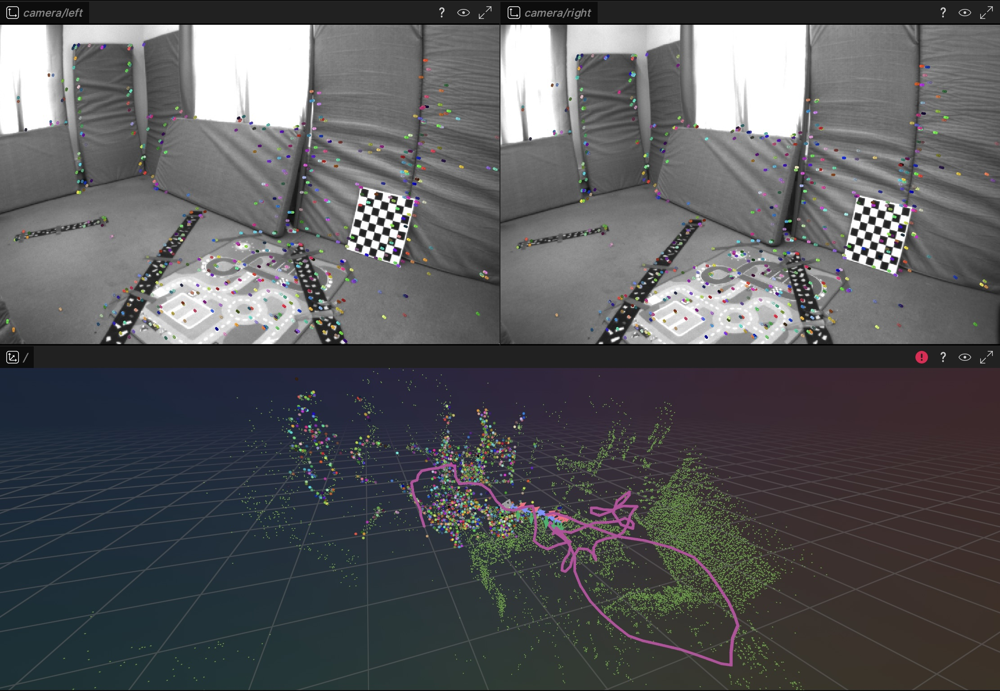

# toy_vo
[](https://crates.io/crates/toy-vo)
[](https://pypi.org/project/toy-vo)

A very simple stereo visual odometry library.



## Run Example
#### Python
```bash
pip install toy-vo rerun-sdk==0.32 opencv-python scipy
python3 examples/run_stereo.py -d {your_path/V1_01_easy} -c configs/euroc --rerun
```
#### Rust
```bash
git clone https://github.com/powei-lin/toy_vo.git && cd toy_vo
cargo run -r --example run_stereo -- -d {your_path/dataset-corridor4_512_16} -c configs/tum_vi --rerun
```